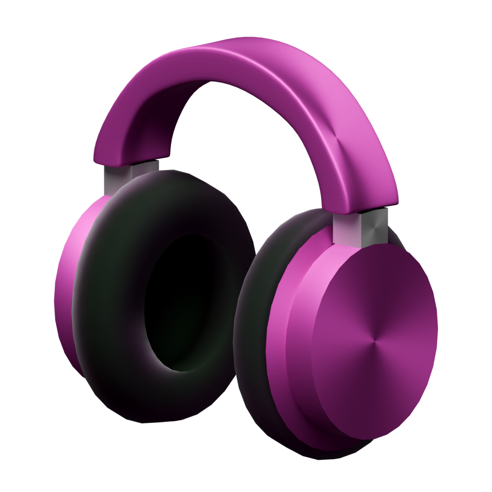
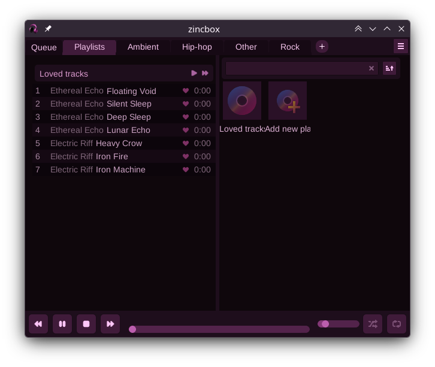

<div style="display: flex; align-items: center; justify-content: center; gap: 20px;">
  
  <h1>zincbox music player</h1>
</div>

### A versatile music player



# Instructions

The top panel displays your file collections, alongside dedicated 'Playlists' view for user-created playlists and 'Queue' view for active playback.

To add a new collection, click the **+** button on the top panel, or simply drag and drop folders directly into the application window. When adding multiple folders, you may choose to merge them into a single collection or keep them separate.

Press **Ctrl+F** to open the search window and quickly locate any track or playlist.

To access configuration such as playback settings or theme options, click the settings icon in the top-right corner of the panel.

# Building and Installation

This project is built using **CMake**. Follow the instructions below to install the required dependencies for your Linux distribution and compile the source code.

## 1. Install Dependencies

### Ubuntu / Debian / Linux Mint

```bash
sudo apt update
sudo apt install build-essential clang cmake pkg-config libsystemd-dev \
libdbus-1-dev libx11-dev libwayland-dev libxkbcommon-dev libgl-dev \
libasound2-dev libxrandr-dev libxinerama-dev libxcursor-dev libxi-dev
```

### Fedora / RHEL / AlmaLinux

```bash
sudo dnf check-update
sudo dnf install gcc-c++ clang make cmake pkgconf-pkg-config systemd-devel \
dbus-devel libX11-devel wayland-devel libxkbcommon-devel mesa-libGL-devel \
alsa-lib-devel libXrandr-devel libXinerama-devel libXcursor-devel libXi-devel
```

### Arch Linux / Manjaro

```bash
sudo pacman -Syu
sudo pacman -S base-devel clang cmake pkgconf systemd dbus libx11 \
wayland libxkbcommon mesa alsa-lib libxrandr libxinerama libxcursor libxi
```

### openSUSE

```bash
sudo zypper refresh
sudo zypper install gcc-c++ clang make cmake pkgconf systemd-devel \
dbus-1-devel libX11-devel wayland-devel libxkbcommon-devel Mesa-libGL-devel \
alsa-devel libXrandr-devel libXinerama-devel libXcursor-devel libXi-devel
```

## 2. Build

Build using the provided script (`build.sh`) with optional flags:

- **debug** — Build in debug mode (default)
- **release** — Build in release mode
- **clang** — Use Clang (default)
- **gcc** — Use GCC
- **asan** — Enable AddressSanitizer
- **run** — Run the program after build
- **clean** — Remove build directory

For example
`./build.sh release run`

# Technical Details

Low level functions such as window management and system event handling are managed via GLFW.

The interface utilizes a custom retained-mode GUI library, leveraging `glad` for OpenGL rendering and FreeType for text.

Music discovery uses `std::filesystem` for traversal and `TagLib` for metadata, with built-in handling for moved files and updated metadata.

Playback is handled by `miniaudio`, with `sdbus-cpp` integration on Linux to enable desktop environment media controls.

The built-in theme is bundled directly into the executable using C++26 `#embed` and functions as a fallback if no valid theme is found in the themes directory.
