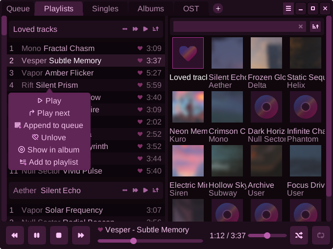

<div style="display: flex; align-items: center; justify-content: center; gap: 20px;">
  
  <h1>zincbox music player</h1>
</div>

### A versatile music player



# Quick guide

The top panel displays your file collections, alongside dedicated _Playlists_ view for user-created playlists and _Queue_ view for active playback.

When a collection or the _Playlists_ view is opened, the main view splits into two areas: the left panel displays tracklists grouped by album or playlist, while the right panel provides a grid of covers. Selecting any album or playlist from the grid shows its tracks in the left panel.

To add a new collection, click the _+_ button on the top panel, or simply drag and drop folders directly into the application window. When adding multiple folders, you may choose to merge them into a single collection or keep them separate.

The menu button in the top-right corner provides quick access to search (also reachable via _Ctrl+F_), the mini-player toggle, and application settings such as playback configuration and theme options.

# Building and Installation

Zincbox is built with _CMake_. You will need a C++23 compliant compiler (_Clang_ or _GCC_) and a build system (_Make_ or _Ninja_) installed on your system.

## 1. Install Dependencies

### Ubuntu / Debian / Linux Mint

```bash
sudo apt update
sudo apt install cmake pkg-config \
libdbus-1-dev libsystemd-dev \
libgl1-mesa-dev libegl1-mesa-dev \
libxkbcommon-dev \
libx11-dev libxext-dev libxrandr-dev libxcursor-dev libxfixes-dev libxi-dev \
libwayland-dev wayland-protocols libdecor-0-dev
```

### Fedora / RHEL / AlmaLinux

```bash
sudo dnf check-update
sudo dnf install cmake pkg-config \
dbus-devel systemd-devel \
mesa-libGL-devel mesa-libEGL-devel \
libxkbcommon-devel \
libX11-devel libXext-devel libXrandr-devel libXcursor-devel libXfixes-devel libXi-devel \
wayland-devel wayland-protocols-devel libdecor-devel
```

### Arch Linux / Manjaro

```bash
sudo pacman -Syu
sudo pacman -S cmake pkgconf \
dbus systemd-libs \
mesa libgl \
libxkbcommon \
libx11 libxext libxrandr libxcursor libxfixes libxi \
wayland wayland-protocols libdecor
```

### openSUSE

```bash
sudo zypper refresh
sudo zypper install cmake pkg-config \
dbus-1-devel systemd-devel \
Mesa-libGL-devel Mesa-libEGL-devel \
libxkbcommon-devel \
libX11-devel libXext-devel libXrandr-devel libXcursor-devel libXfixes-devel libXi-devel \
wayland-devel wayland-protocols-devel libdecor-devel
```

## 2. Build

### Linux

Build using the provided script (`build.sh`) with optional flags:

| Flag      | Description                   |
| --------- | ----------------------------- |
| `debug`   | Build in debug mode (default) |
| `release` | Build in release mode         |
| `clang`   | Use Clang (default)           |
| `gcc`     | Use GCC                       |
| `ninja`   | Use Ninja (default)           |
| `make`    | Use Make                      |
| `asan`    | Build with AddressSanitizer   |
| `run`     | Run the program after build   |
| `clean`   | Remove the build directory    |

For example
`./build.sh release run`

### Windows

```cmd
cmake -B build -G Ninja -DCMAKE_BUILD_TYPE=Release
cmake --build build
```

# Technical Details

Low level functions such as window management and system event handling are managed via SDL3.

The interface utilizes a custom retained-mode GUI library, leveraging `glad` for OpenGL rendering and FreeType for text.

Music discovery uses `std::filesystem` for traversal and `TagLib` for metadata, handling moved files and updated metadata.

Playback is handled by `miniaudio`, with `sdbus-cpp` integration on Linux to enable desktop environment media controls.

The built-in theme is bundled into the executable using CMakeRC and functions as a fallback if no valid theme is found in the themes directory.
